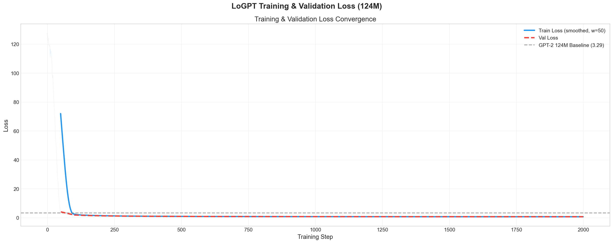
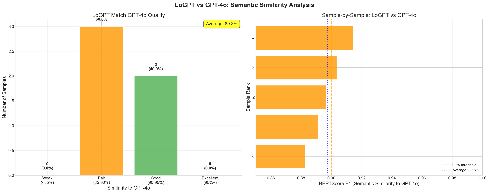
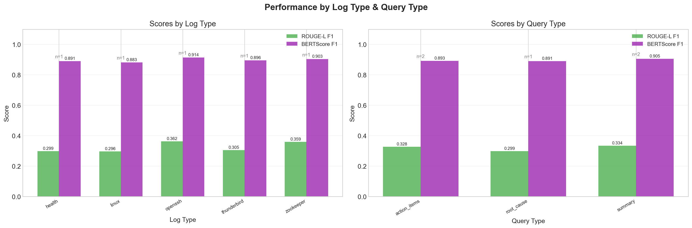

# LoGPT

```
 __                  ______  _______  ________
|  \                /      \|       \|        \
| $$       ______  |  $$$$$$| $$$$$$$\$$$$$$$$
| $$      /      \ | $$ __\$| $$__/ $$ | $$
| $$     |  $$$$$$\| $$|    | $$    $$ | $$
| $$     | $$  | $$| $$ \$$$| $$$$$$$  | $$
| $$_____| $$__/ $$| $$__| $| $$       | $$
| $$     \\$$    $$ \$$    $| $$       | $$
 \$$$$$$$$ \$$$$$$   \$$$$$$ \$$        \$$
```

**LoGPT is a fine-tuned GPT-2 (124M) model for automated log file analysis that runs entirely on local hardware.** It takes raw system logs as input and produces structured summaries, root cause analyses, and action item recommendations -- achieving 89.8% semantic similarity to GPT-4o while using 14,193x fewer parameters and requiring zero API calls.

The model was trained on 5,055 log-analysis pairs across 14 log types (HDFS, OpenSSH, Linux, Zookeeper, Thunderbird, Apache, Hadoop, Spark, and more), with ground truth responses generated by GPT-4o. The result is a specialized, on-device model that fits comfortably on consumer hardware and generates analysis at ~2,400-3,000 tokens/sec on Apple Silicon.

### **[Try the Live Demo →](https://huggingface.co/spaces/Dhruv-Panicker/logpt-demo)**





## Results

LoGPT was trained for 2,000 steps on a single Apple M-series GPU (MPS backend) with the following outcomes:

| Metric | Value |
|--------|-------|
| Test Perplexity | 2.0493 |
| Test Loss | 0.7175 |
| Best Validation Loss | 0.7452 (step 1,999) |
| ROUGE-L F1 | 0.324 |
| BERTScore F1 | 0.898 (89.8% similarity to GPT-4o) |
| Parameters | 124M (vs GPT-4o's ~1.76T) |
| Parameter Efficiency | 14,193x smaller than GPT-4o |
| Inference Speed | ~2,400-3,000 tokens/sec (Apple Silicon) |

The model achieves strong semantic similarity across all tested log types and query types:



Key observations from training:
- Training loss converged from 127.73 to 0.85 over 2,000 steps
- Validation loss stabilized at 0.7452, indicating good generalization with minimal overfitting
- Cosine learning rate schedule with linear warmup (100 steps) peaked at 2e-5
- The model outperformed the GPT-2 124M baseline loss of 3.29 within the first 200 steps

## Live Demo

LoGPT is deployed as a web application on [HuggingFace Spaces](https://huggingface.co/spaces/Dhruv-Panicker/logpt-demo) with an NVIDIA T4 GPU for fast inference. Upload a `.log` or `.txt` file (or paste log content directly), select an analysis type, and get streaming results in seconds — no installation required.

The web interface features:
- **File upload or paste** — supports `.log` and `.txt` files of any size
- **Three analysis modes** — Summary, Root Cause Analysis, and Action Items
- **Streaming output** — tokens appear in real-time as the model generates
- **Chunk navigation** — large logs are split into chunks with ◀ ▶ navigation, generating each chunk on demand
- **Built with Gradio** — minimal, clean UI deployed on HuggingFace Spaces

The model checkpoint (~652MB) is hosted on [HuggingFace Hub](https://huggingface.co/Dhruv-Panicker/logpt-gpt2-log-analyzer) and downloaded automatically on first launch.

## Getting Started

### Prerequisites

- Python 3.10+
- PyTorch 2.0+
- ~500MB disk space for model checkpoint

### Installation

```bash
git clone https://github.com/Dhruv-Panicker/logpt.git
cd logpt
python3 -m venv venv
source venv/bin/activate
pip install -e .
```

### Analyze a log file

Once installed, the `logpt` CLI is available system-wide:

```bash
logpt --file /var/log/system.log --query summary
```

The CLI supports three query types, matching the three modes the model was trained on:

```bash
# Summarize what happened in the logs
logpt --file server.log --query summary

# Identify root cause of errors
logpt --file app.log --query root_cause

# Get actionable recommendations
logpt --file nginx.log --query action_items
```

You can also pipe logs via stdin:

```bash
tail -500 /var/log/syslog | logpt --query summary
cat error.log | logpt --query root_cause
kubectl logs my-pod | logpt --query action_items
```

### CLI Options

```
usage: logpt [-h] [--file FILE] --query {summary,root_cause,action_items}
             [--model MODEL] [--temperature TEMPERATURE]
             [--max-tokens MAX_TOKENS]

  --file, -f           Path to log file (or pipe via stdin)
  --query, -q          Type of analysis: summary, root_cause, action_items
  --model, -m          Path to model checkpoint (default: auto-detect)
  --temperature        Generation temperature (default: 0.7)
  --max-tokens         Max tokens to generate per chunk (default: 256)
```

### Example Output

```
══════════════════════════════════════════
  LoGPT -- Local Log Analysis
  GPT-2 124M - Fine-tuned - On-Device
══════════════════════════════════════════
  Source: k8s_error.log (78 lines)
  Query:  summary
  Chunks: 2

=== Chunk 1/2 (44 lines) ===----------------------

The Kubernetes node (node-001) experienced a cascading failure
beginning with memory exhaustion at 14:26. The initial trigger
was insufficient memory for nginx-deployment pods (512Mi required,
128Mi available). This led to PLEG health check failures, eviction
manager activation, and ultimately the node transitioning to
NotReady state...

[Chunk 1 generated in 3.2 seconds]
──────────────────────────────────────────────────────

Continue to chunk 2/2? [Y/n]
```

## Handling Large Log Files

LoGPT's context window is 1,024 tokens. Rather than imposing a file size limit on the user, the CLI handles large files internally through chunking:

1. The log file is split into sequential chunks that fit within the model's context window
2. Each chunk respects line boundaries (never cuts a line in half)
3. The model generates an analysis for each chunk
4. After each chunk's response, the user is prompted to continue or stop

This means a 100,000-line log file works the same as a 50-line file from the user's perspective. The user controls how deep into the file they want to analyze, and compute is only spent on chunks the user actually reads.

| File Size | Approximate Chunks | User Experience |
|-----------|-------------------|-----------------|
| < 50 lines | 1 | Single direct analysis |
| 50 - 500 lines | 2-5 | Paginated, 2-5 prompts |
| 500 - 5,000 lines | 5-50 | Paginated, stop when satisfied |
| 5,000+ lines | 50+ | Paginated, focus on areas of interest |

## Architecture

LoGPT is built on the GPT-2 (124M) transformer architecture with the following modifications for log analysis:

- **Custom special tokens**: `<|log_start|>`, `<|log_end|>`, `<|query_start|>`, `<|query_end|>`, `<|response_start|>`, `<|response_end|>` delineate the structured prompt format
- **Resized embeddings**: Token and output projection layers expanded to accommodate the 6 additional special tokens
- **Fine-tuning regime**: AdamW optimizer with cosine learning rate schedule, linear warmup over 100 steps, peak LR of 2e-5, weight decay of 0.1, gradient clipping at 1.0

The prompt format follows the structure used during training:

```
<|log_start|>
[raw log content]
<|log_end|>
<|query_start|>
Summarize these openssh logs
<|query_end|>
<|response_start|>
[model generates response here]
<|response_end|>
```

### Training Configuration

| Parameter | Value |
|-----------|-------|
| Base Model | GPT-2 124M (pretrained from HuggingFace) |
| Context Length | 1,024 tokens |
| Batch Size | 2 (micro), 16 (effective via gradient accumulation) |
| Gradient Accumulation Steps | 8 |
| Learning Rate | 2e-5 (peak), cosine decay |
| Warmup Steps | 100 |
| Total Training Steps | 2,000 |
| Weight Decay | 0.1 |
| Gradient Clipping | 1.0 |
| Optimizer | AdamW (beta1=0.9, beta2=0.95, eps=1e-8) |
| Hardware | Apple Silicon (MPS backend) |
| Training Data | 5,055 samples (85% train / 10% val / 5% test) |

## Training Data

The training data was constructed through a synthetic data generation pipeline:

1. **Source logs**: Raw system logs from 14 different log types sourced from the Loghub dataset (see [Citation](#citation))
2. **Chunking**: Each log file was split into chunks that fit within the 1,024 token context window
3. **Query generation**: Three query types were generated per chunk: `summary`, `root_cause`, `action_items`
4. **Response generation**: GPT-4o generated the ground truth responses via the OpenAI Batch API, producing structured analyses for each log chunk and query combination
5. **Assembly**: Each training sample was formatted with special tokens into the prompt-response structure shown above

The 14 log types cover a broad range of systems:

| Category | Log Types |
|----------|-----------|
| Distributed Systems | HDFS, Hadoop, Spark, Zookeeper, OpenStack |
| Supercomputers | BGL, HPC, Thunderbird |
| Operating Systems | Linux, Mac |
| Server Applications | Apache, OpenSSH |
| Mobile / Health | HealthApp |
| Standalone Software | Proxifier |

## Evaluation

The model was evaluated on the held-out test set using multiple metrics:

**Perplexity (2.05)**: Measures how well the model predicts the next token. A perplexity of 2.05 means the model is, on average, choosing between ~2 equally likely tokens at each step, indicating strong confidence in its predictions for log analysis tasks.

**ROUGE-L F1 (0.324)**: Measures longest common subsequence overlap with GPT-4o's responses. The moderate score is expected -- the model produces semantically equivalent analyses with different surface-level phrasing, which is desirable behavior rather than rote memorization.

**BERTScore F1 (0.898)**: Measures semantic similarity using contextual embeddings (roberta-large). This is the most informative metric for this task. At 89.8%, it confirms that LoGPT's responses carry nearly the same meaning as GPT-4o's, despite being generated by a model with 14,193x fewer parameters.

The gap between ROUGE (lexical) and BERTScore (semantic) scores is characteristic of successful knowledge distillation: the student model learns the underlying reasoning patterns rather than copying exact phrasing.

## File Structure

```
.
├── README.md
├── pyproject.toml
├── requirements.txt
├── app.py                              # Gradio web application (HuggingFace Spaces)
├── cli
│   ├── __init__.py
│   ├── interface.py                    # CLI entry point, argument parsing, user interaction
│   └── processor.py                    # Log file chunking for context window
├── data
│   ├── batch_input_*.jsonl             # OpenAI Batch API input files
│   ├── batch_output_*.jsonl            # GPT-4o generated responses
│   └── training
│       └── training_data.jsonl         # Assembled training data (5,055 samples)
├── dev
│   ├── data_analysis.ipynb             # Pre-training data exploration
│   └── post_analysis.ipynb             # Post-training metrics and visualizations
├── logpt
│   ├── __init__.py
│   ├── dataloader.py                   # Training data loader with batching
│   ├── execution.py                    # Training loop, gradient accumulation, checkpointing
│   ├── gpt.py                          # GPT-2 model implementation (from scratch)
│   ├── inference.py                    # Model loading, prompt formatting, generation (streaming + sync)
│   ├── test.py                         # Test evaluation (ROUGE, BERTScore, perplexity)
│   └── tokenizer.py                    # GPT-2 tokenizer with special token registration
├── logs
│   ├── best_model.pth                  # Best model checkpoint (~652MB)
│   └── *.png                           # Training plots and visualizations
├── scripts
│   ├── batch.py                        # OpenAI Batch API client for data generation
│   └── generate.py                     # Training data generation orchestration
├── tasks
│   └── context.py                      # Log type definitions, query templates
└── tests
    ├── k8s_error.log                   # Sample Kubernetes error log for testing
    └── apache_error.log                # Sample Apache error log for testing
```

## Research

The post-training analysis is documented in [`dev/post_analysis.ipynb`](dev/post_analysis.ipynb), which includes:

- Training and validation loss convergence curves
- Learning rate schedule visualization
- Loss convergence rate analysis (delta loss per step)
- ROUGE and BERTScore breakdowns by log type and query type
- LoGPT vs GPT-4o semantic similarity distribution
- Qualitative side-by-side response comparisons

Key findings from the analysis:

1. **Rapid convergence**: The model crossed below the GPT-2 baseline loss (3.29) within 200 steps, indicating the pretrained weights transfer well to the log analysis domain.
2. **Minimal overfitting**: The train-validation gap remained small throughout training (final train loss 0.85 vs val loss 0.75), suggesting the model generalizes well despite the relatively small dataset.
3. **Consistent performance across domains**: BERTScore F1 ranged from 0.883 (Linux) to 0.914 (OpenSSH) across log types, showing the model does not overfit to any single log format.
4. **Query type robustness**: Summary queries scored highest (0.905 BERTScore F1), followed by action items (0.893) and root cause (0.891), all within a tight range.

## Citation

This project uses log datasets from the Loghub collection. If you use LoGPT or its training data in your research, please cite:

**Zhu et al. (2023)**: Loghub: A Large Collection of System Log Datasets for AI-driven Log Analytics. *IEEE International Symposium on Software Reliability Engineering (ISSRE)*, 2023.

**Jiang et al. (2024)**: A Large-scale Evaluation for Log Parsing Techniques: How Far are We? *ACM SIGSOFT International Symposium on Software Testing and Analysis (ISSTA)*, 2024.

The Loghub datasets are freely available for research at [https://github.com/logpai/loghub](https://github.com/logpai/loghub).

## Deployment

The web application is deployed on HuggingFace Spaces with the following stack:

| Component | Detail |
|-----------|--------|
| App Framework | Gradio 6 |
| Hosting | HuggingFace Spaces |
| GPU | NVIDIA T4 Small (16GB VRAM) |
| Model Hosting | HuggingFace Hub |
| Model Download | Automatic on first launch via `huggingface_hub` |
| Streaming | Token-by-token generation via Python generators |

To run the web app locally:

```bash
pip install -e .
python app.py
```

The model checkpoint is auto-detected from `logs/best_model.pth` when running locally, or downloaded from [HuggingFace Hub](https://huggingface.co/Dhruv-Panicker/logpt-gpt2-log-analyzer) if not found.

## License

MIT
